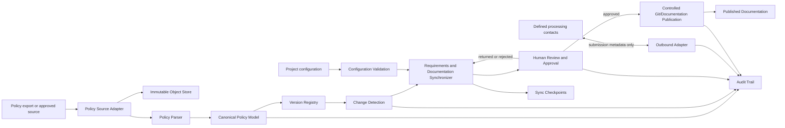
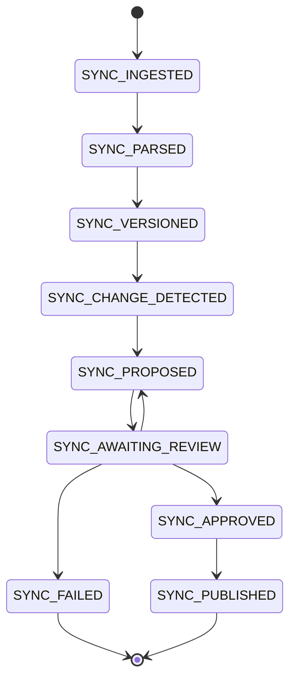

# Architecture

## Architecture Summary

The Automated Documentation Sync system is a controlled documentation pipeline for synchronizing requirements and related SDLC documentation with changes in the Overtime Compensation Policy. It stores immutable source-policy versions, parses policy and FAQ content, detects semantic changes, proposes documentation updates, and requires human approval before any synchronized artifact is finalized.

The system does not calculate payroll, execute payments, confirm payments, approve policy exceptions, or claim a payment SLA. It may store overtime-related requirements and submission metadata only where required by the approved requirements.

## Component List

1. **Policy Source Adapter**: Imports policy exports and records source metadata.
2. **Document Object Store**: Stores immutable original files and normalized extracts.
3. **Policy Parser**: Extracts structured policy, FAQ, links, tables, dates, and attachments.
4. **Policy Canonical Model**: Represents source statements, FAQ statements, versions, and provenance.
5. **Version Registry**: Maintains immutable policy versions and effective dates.
6. **Change Detection Engine**: Compares policy versions and classifies changes.
7. **Requirements Synchronizer**: Maps source changes and approved clarifications to requirement identifiers.
8. **Documentation Generator**: Produces proposed documentation updates with provenance.
9. **Human Review and Approval Service**: Presents changes and records approval, rejection, or return decisions.
10. **Audit Trail Service**: Records immutable processing, decision, and artifact history.
11. **Configuration and Validation Service**: Validates project calendar, week boundaries, time zone, and working-hour configuration where applicable.
12. **Workflow API and Review UI**: Provides controlled access to runs, differences, approvals, and status history.
13. **Notification Adapter**: Delivers review and error notifications without becoming a payroll processor.
14. **Documentation Publication Adapter**: Publishes only approved documentation change sets through a protected branch/change-set and pull request, or an equivalent protected repository mechanism. The specific provider is not assumed.
15. **Outbound Submission Adapter**: Records or forwards approved documentation/submission metadata to the defined processing destinations; it does not process payments.
16. **Synchronization Checkpoint Store**: Persists run stages, change-set state, retries, and publication idempotency keys.

## System Context

The authoritative inputs are the supplied policy source, its FAQ and attachments, approved clarification decisions, and project configuration. Final documentation is an output only after human approval. The source policy remains the provenance authority for policy-derived statements; human-approved clarifications remain distinct from source text.

## Major Components and Responsibilities

### Policy Source Adapter

- Accept policy exports such as the supplied Confluence-generated MHTML/Word-compatible `.doc` package.
- Preserve the original bytes, source identifier, received timestamp, media type, and attachment relationships.
- Reject unsupported or malformed input without silently treating it as valid policy content.
- Treat an empty or contentless policy document as invalid: preserve the original input for audit, block synchronization, require human review, and do not generate a documentation update from it.
- Never overwrite an existing source version.

### Document Object Store

- Store immutable source documents, extracted text, embedded attachments, and generated review snapshots.
- Encrypt stored content and provide content hashes for integrity.
- Keep source content separate from generated requirements and architecture artifacts.

### Policy Parser

- Parse the HTML body, tables, headings, lists, links, FAQ entries, effective dates, and embedded resources.
- Decode the source document's transfer encoding and preserve the original text where parsing is uncertain.
- Produce parser warnings for malformed markup, conflicting contacts, contradictory formulas, missing attachments, and incomplete FAQ entries.
- Preserve source locations and statement-level provenance.

### Policy Canonical Model

Represent each extracted statement with:

- Policy version identifier
- Source section or FAQ identifier
- Statement text and normalized representation
- Classification: Source Policy or Source FAQ
- Effective date when present
- Source location and content hash
- Conflict or inconsistency flags

Human-approved clarifications are stored as separate approved decision records and are never merged into source text.

### Version Registry

- Assign immutable version identifiers.
- Record source metadata, content hash, effective date, and supersession relationship.
- Support comparison of adjacent or explicitly selected versions.
- Preserve the 1 August 2026 effective-date statement as source provenance rather than inferring dates for other rules.

### Change Detection Engine

- Compare normalized statements, tables, FAQ entries, contacts, formulas, thresholds, and effective dates.
- Detect additions, removals, modifications, and reordering without treating formatting-only changes as policy changes unless configured.
- Flag contradictory statements for human review.
- Preserve source text and flag ambiguous or low-confidence changes for human review; do not silently resolve them or finalize synchronization until every unresolved change has an explicit review outcome.
- Produce a change set linked to source versions and source locations.

### Requirements Synchronizer

- Map approved source changes to stable requirement identifiers such as `FR-XXX`, `NFR-XXX`, `BR-XXX`, and acceptance criteria.
- Preserve primary classification for every requirement.
- Keep Source Policy, Source FAQ, Human-Approved Clarification, System Decision, Not Found, and Out of Scope records distinct.
- Mark unsupported values or behaviors as `Not Found` rather than inferring them.
- Detect affected requirements when formulas, thresholds, contacts, calendars, deadlines, or governance statements change.

### Documentation Generator

- Generate proposed updates to requirements and other approved documentation artifacts.
- Include traceability from source statement to requirement to generated section.
- Produce a review diff and validation report.
- Never publish or finalize generated documentation without human approval.

### Documentation Publication Adapter

- Accept only an approved change-set identifier.
- Before publication, verify that approval exists, approval evidence is valid, reviewer identity and authorization are valid, and the artifact hash matches the approved artifact.
- Publish through a protected branch/change-set and pull request, or an equivalent protected repository mechanism.
- Prevent direct unapproved publication and reject duplicate publication attempts using the change-set identity and artifact hash.
- The Git provider, repository provider, and exact protected mechanism are pending human approval.

### Human Review and Approval Service

- Present source differences, proposed requirement changes, conflicts, and unresolved `Not Found` items.
- Support review outcomes such as approved, rejected, or returned as workflow behavior; these are system workflow states and not policy statuses.
- Require an authenticated reviewer and retain approval evidence/reference.
- Keep policy-level exception authority as `Not Found`; this service does not authorize policy exceptions.
- Expose explicit `SYNC_*` documentation synchronization statuses and keep them separate from `OVERTIME_*` workflow statuses. No status model is mapped directly between the two.

### Audit Trail Service

- Record ingestion, parsing, versioning, change detection, synchronization, review, approval, generation, and publication events.
- Store actor, timestamp, input/version identifiers, decision, evidence reference, and resulting artifact hash.
- Make audit records append-only and queryable.

### Configuration and Validation Service

- Validate that project working hours are exactly 8 or 9.
- Treat missing working hours as `Not Found` and other values as invalid configuration; both block calculation-related documentation generation.
- Validate the project calendar, weekly start/end boundaries, and time zone.
- Treat missing calendar configuration as `Not Found` and block threshold-related synchronization until human configuration is provided.
- Do not invent a default calendar, week start day, or time zone.
- Validate all required captured inputs, including associate identifier, project code, overtime date, overtime hours, approval evidence, and required configuration.
- Record a missing required value as `Not Found` where applicable, block the affected operation, and never infer or fabricate it.

### Synchronization Checkpoint Store

- Persist the synchronization run and change-set after each stage.
- Track `SYNC_INGESTED`, `SYNC_PARSED`, `SYNC_VERSIONED`, `SYNC_CHANGE_DETECTED`, `SYNC_PROPOSED`, `SYNC_AWAITING_REVIEW`, `SYNC_APPROVED`, `SYNC_PUBLISHED`, and `SYNC_FAILED`.
- Preserve earlier state when a later stage fails and support safe retry or resume where possible.
- Use idempotency and artifact identity to prevent duplicate publication.

## Data Flow

1. A policy export is received by the Policy Source Adapter and the run is recorded as `SYNC_INGESTED`.
2. The original package and metadata are written to immutable storage and hashed.
3. An empty or contentless document is preserved, marked invalid, recorded as `SYNC_FAILED`, and routed to human review without generating an update.
4. The Policy Parser extracts policy statements, FAQ statements, tables, links, dates, and attachments; successful completion records `SYNC_PARSED`.
5. Parser output is stored with statement-level provenance and warnings.
6. The Version Registry creates an immutable policy version and records `SYNC_VERSIONED`.
7. The Change Detection Engine compares the selected version with its predecessor and records `SYNC_CHANGE_DETECTED`.
8. Ambiguous or low-confidence changes preserve source text, remain flagged, and cannot proceed without an explicit review outcome.
9. The Requirements Synchronizer identifies affected requirements and records `SYNC_PROPOSED` while retaining all classification boundaries.
10. The Documentation Generator creates a proposed change set and traceability report.
11. Configuration and required-input validation blocks affected operations when required values are missing or invalid.
12. The Human Review Service presents the proposed changes, conflicts, and `Not Found` items with status `SYNC_AWAITING_REVIEW`.
13. A human reviewer approves, rejects, or returns the proposed documentation update; approval records `SYNC_APPROVED`.
14. The Documentation Publication Adapter verifies the approved change set and publishes it atomically through the protected repository mechanism as `SYNC_PUBLISHED`.
15. Any later failure preserves the earlier checkpoint, records `SYNC_FAILED`, and prevents successful finalization.
16. Audit records are written for every state change and artifact version.
17. Where explicitly required, submission metadata is sent through the separate outbound adapter to Ask Compensation or TA Operations. No payment is initiated or confirmed.

## Policy Document Ingestion

The supplied policy is a Confluence export delivered as a Word-compatible MHTML package containing an HTML body and an embedded image attachment. Ingestion must:

- Preserve the original package unchanged.
- Validate media type and package boundaries.
- Decode quoted-printable HTML and embedded resources.
- Extract the policy body independently from binary attachments.
- Record attachment names, content types, hashes, and unresolved references.
- Treat external links, mail addresses, and attachment URLs as untrusted data.
- Report incomplete or unavailable source material as `Not Found` where it affects a requirement.
- Treat an empty or contentless policy document as invalid, preserve it for audit, block synchronization, require human review, and do not generate a documentation update from it.

Ingestion is source capture only; it does not establish policy validity or approval.

## Policy Parsing

Parsing uses a structured HTML/MHTML parser rather than regular expressions alone. The parser should extract:

- Heading and section hierarchy
- Paragraphs, lists, tables, and FAQ question/answer pairs
- Links and email addresses
- Effective dates and version history rows
- Formula text, thresholds, rates, deadlines, and contacts
- Embedded attachments and unresolved references

The parser must preserve both raw and normalized text. Normalization may remove markup noise, but it must not silently resolve contradictions. Conflicting formulas, contacts, and FAQ statements become explicit conflict records.

## Policy Versioning

Each source package receives an immutable version record containing its source identifier, content hash, ingestion timestamp, effective date if present, parser version, and predecessor reference. Generated artifacts reference the exact policy version and clarification-decision set used to produce them.

A policy version is not replaced in place. Corrections or later exports create new versions. A human-approved clarification is versioned separately and records its approval evidence and scope.

## Change Detection

Change detection operates at statement and structural levels:

- Exact and normalized text comparison for statements
- Semantic comparison for numeric formulas, thresholds, deadlines, and contacts
- Table row and FAQ pair comparison
- Effective-date and version-history comparison
- Conflict detection when two statements define incompatible values

Each change produces an evidence record containing old value, new value, source locations, classification, confidence/warning information, and affected requirement identifiers. The system must not convert low-confidence extraction into an authoritative change automatically.

## Requirements and Documentation Synchronization

Synchronization is a proposal workflow:

- Source-derived statements map to Source Policy or Source FAQ requirements.
- Approved clarification records map to Human-Approved Clarification requirements.
- System behavior maps to System Decision requirements.
- Undefined behavior or missing configuration maps to `Not Found`.
- Explicitly excluded policy topics map to Out of Scope dispositions.

The synchronizer preserves stable identifiers and updates traceability references when documentation sections move. It must retain conflict records, including the conflicting subcontractor FAQ contact, rather than silently deleting them.

The synchronization boundary ends at proposed or human-approved documentation. It does not implement overtime calculation, payroll, payment processing, payment confirmation, or policy-exception approval.

## Human Approval Workflow

The state names above are the canonical documentation synchronization workflow states. They do not replace or reinterpret the overtime workflow statuses in the requirements. Approval must include authenticated reviewer identity, decision timestamp, decision rationale where provided, evidence/reference, source version, clarification version, and generated artifact hash.

Documentation synchronization statuses use the `SYNC_*` namespace. Overtime workflow statuses use the `OVERTIME_*` namespace. The two status models are stored and exposed separately and are never mapped directly to one another.

The publication boundary must enforce authorization: the publication adapter accepts only an approved change-set identifier and verifies approval existence, valid approval evidence, valid reviewer identity and authorization, and an artifact hash matching the approved artifact. Direct unapproved publication is prevented by the protected repository mechanism.

Policy-level exception authority is `Not Found`; approval of a documentation synchronization change is not approval of a policy exception.

## Audit Trail

Audit events should include:

- Event identifier and event type
- Actor or service identity
- Timestamp and configured time zone context
- Source and generated artifact hashes
- Policy version and clarification decision references
- Before/after change references
- Classification and conflict flags
- Human review decision and evidence/reference
- Error, retry, and blocking reason

Audit records should be append-only, tamper-evident, retained according to an approved retention policy, and accessible only to authorized users. The retention period and detailed access model are `Not Found` in the requirements and require human approval.

## Error Handling

- Unsupported or malformed source package: reject ingestion and record the failure.
- Parser uncertainty: retain raw content, emit a warning, and require human review before synchronization.
- Missing source section or attachment: record `Not Found`; do not fabricate content.
- Empty or contentless policy document: preserve the original, mark it invalid, block synchronization, require human review, and generate no documentation update.
- Conflicting formula, threshold, or contact: preserve both statements, flag the conflict, and use only the approved clarification for authoritative system behavior.
- Missing calendar, week start day, or time zone: report `Not Found` and block affected evaluation.
- Invalid or missing project working hours: report invalid configuration or `Not Found` and block calculation-related processing.
- Missing wage data: report `Not Found`, block calculation-related processing, and direct the Delivery Manager to the HRBP. No fallback wage is used.
- Missing approval evidence: do not treat the change or overtime request as approved; automatic disposition is `Not Found`.
- Missing required captured input: record `Not Found` where applicable, block the affected operation, and do not infer or fabricate the value.
- If any unresolved or low-confidence change lacks an explicit review outcome, keep synchronization pending and do not finalize it.
- Downstream documentation repository failure: preserve the approved change set and audit event, retry only under an approved retry policy, and do not claim finalization until confirmed.
- Payment-processing failure or confirmation: the system may record the supplied status, but payment confirmation evidence and payment SLA remain `Not Found`.

## Security

Security controls are System Decisions because detailed access-control requirements are `Not Found` in the policy:

- Authenticate all human reviewers and administrative users.
- Authorize access by least privilege for source documents, wage data, approvals, and generated artifacts.
- Encrypt source documents, extracted policy content, approval evidence, and audit data in transit and at rest.
- Protect credentials and integration secrets using the deployment environment's secret store; never store them in documentation artifacts.
- Validate and sandbox document parsing where feasible because source packages contain HTML, links, and embedded resources.
- Treat email addresses and external links as untrusted content.
- Log security-relevant access and review events without exposing sensitive content unnecessarily.
- Apply an approved retention and deletion policy; the specific policy is `Not Found`.

## External Integrations

| Integration | Direction | Purpose | Boundary |
|---|---|---|---|
| Policy source or document repository | Inbound | Receive policy exports and metadata | Source capture only; source authority and approval remain external. |
| Documentation repository | Outbound | Store proposed and human-approved documentation artifacts | Finalization requires human approval. |
| Controlled Git/documentation publication | Outbound | Publish an approved change set through a protected branch/change-set and pull request, or equivalent protected mechanism | Publication verifies approval, evidence, reviewer authorization, and artifact hash; provider is pending human approval. |
| Review identity provider | Inbound | Authenticate reviewers and actors | Provider and claims are deployment decisions. |
| Notification service | Outbound | Notify reviewers of changes, conflicts, and blocked runs | No policy decision is made by notifications. |
| Ask Compensation | Outbound | Submit approved regular-employee overtime documentation/metadata where required | No payroll or payment processing. |
| TA Operations at `WFATAReportingAndAnalyticsIndia@epam.com` | Outbound | Submit approved subcontractor overtime documentation/metadata where required | This is the authoritative clarified contact; no payment processing. |
| HRBP | Outbound notification/reference | Escalate missing wage data | No wage fallback or calculation authority is introduced. |

Payment confirmation source/evidence and payment-processing SLA are `Not Found`. Policy-level exception authority is `Not Found`.

## Storage

A relational store is recommended for canonical statements, versions, requirements, traceability, workflow, configuration, and audit indexes. An encrypted object store is recommended for original policy packages, attachments, parser outputs, and generated snapshots.

Minimum logical records:

- `PolicyDocument` and immutable content hash
- `PolicyVersion`
- `PolicyStatement` and `SourceLocation`
- `FAQEntry`
- `ConflictRecord`
- `ClarificationDecision`
- `RequirementLink`
- `DocumentationChangeSet`
- `PublicationArtifact` containing the generated documentation artifact, artifact hash, protected Git branch or equivalent change-set reference, pull request or equivalent review-object reference, and approval-evidence reference
- `ReviewDecision`
- `WorkflowEvent`
- `ProjectConfiguration`
- `AuditEvent`

The data model must support `Not Found` as an explicit value/state and must not substitute nulls with inferred defaults. Wage data and associate identifiers require stronger access controls than ordinary policy text.

## Technology Recommendations

These are recommendations, not additional business rules:

- **Runtime**: Python with a typed service layer for document parsing and synchronization workflows.
- **API**: FastAPI or an equivalent typed HTTP API for ingestion, review, status, and artifact operations.
- **Parsing**: Standards-compliant MIME/MHTML and HTML parsers, plus a table parser; preserve raw input alongside normalized output.
- **Persistence**: PostgreSQL or equivalent relational database for metadata, traceability, workflow, and audit indexes.
- **Binary storage**: S3-compatible or Azure Blob-compatible encrypted object storage for source packages and artifacts.
- **Workflow execution**: A durable queue and worker model for parsing and change detection; exact provider is a deployment decision.
- **UI**: A small authenticated review interface focused on diffs, provenance, conflicts, and approval evidence.
- **Observability**: Structured logs, metrics, traces, parser warnings, and audit correlation identifiers.
- **Testing**: Fixture-based tests for MHTML/HTML exports, tables, FAQ extraction, conflicts, missing configuration, and human-approval gates.

No recommendation introduces payroll, payment execution, or policy-exception authority.

## Scalability

- Process policy documents asynchronously so ingestion requests remain responsive.
- Use content hashes and parser-versioned caches to avoid reparsing unchanged source packages.
- Partition audit and event data by time or policy version as volume grows.
- Keep parsing and change detection workers stateless and horizontally scalable.
- Use idempotency keys for ingestion and synchronization runs.
- Keep generated artifacts immutable so concurrent reviews do not overwrite one another.
- Separate policy parsing load from review UI/API load.

The expected policy-change frequency and document volume are `Not Found`; capacity sizing requires human or operational input.

## Reliability

- Preserve original source bytes before parsing.
- Use transactional version registration and change-set creation.
- Make ingestion, parsing, and synchronization idempotent.
- Persist synchronization checkpoints and change-set state after every stage: `SYNC_INGESTED`, `SYNC_PARSED`, `SYNC_VERSIONED`, `SYNC_CHANGE_DETECTED`, `SYNC_PROPOSED`, `SYNC_AWAITING_REVIEW`, `SYNC_APPROVED`, `SYNC_PUBLISHED`, or `SYNC_FAILED`.
- Retry transient storage or notification failures with bounded, observable retries.
- Quarantine malformed or suspicious packages.
- Fail closed when required configuration or approval evidence is missing.
- Never finalize documentation without recorded human approval.
- Reconcile generated artifact hashes with stored change sets.
- Preserve earlier checkpoints after later-stage failure, allow safe retry or resume where possible, and make final publication atomic from the documentation system's perspective.
- Provide backup and restore for relational metadata and object storage; recovery objectives are `Not Found`.

## Architecture Decisions

### AD-001: Documentation synchronization is the system boundary

**Status:** Approved by requirements.

**Decision:** The system synchronizes policy-derived documentation and metadata only. Payroll, payment execution, payment confirmation, and policy-exception approval are outside the boundary.

**Basis:** Approved requirements explicitly prohibit implementing payroll/payment processing and retain payment SLA, payment evidence, and policy-exception authority as `Not Found`.

**Approval needed:** Human approval of this architecture boundary.

### AD-002: Immutable source and artifact versions

**Status:** Architecture recommendation; requires human approval.

**Decision:** Store source documents, policy versions, clarification decisions, change sets, and finalized artifacts immutably with hashes.

**Basis:** Required traceability and auditability.

**Approval needed:** Human approval of retention and storage lifecycle details, which are otherwise `Not Found`.

### AD-003: Provenance is statement-level

**Status:** Approved by requirements; architecture detail recommended for implementation.

**Decision:** Every source statement and generated requirement link includes policy version, source section/FAQ location, classification, and content hash.

**Basis:** Preserve traceability from source policy to requirement to generated documentation.

### AD-004: Clarifications are separate authority records

**Status:** Approved by requirements; architecture detail recommended for implementation.

**Decision:** Human-approved clarifications are stored separately from Source Policy and Source FAQ text and may provide authoritative system behavior where explicitly approved.

**Basis:** Requirements require clear separation of source wording and approved decisions.

### AD-005: Fail closed on missing required configuration

**Status:** Approved by requirements.

**Decision:** Missing project calendar, week boundaries, time zone, or wage data blocks the affected evaluation/calculation and reports `Not Found`; invalid working hours also block calculation.

**Basis:** Approved requirements.

### AD-006: Human approval gates finalization

**Status:** Approved by requirements; protected publication enforcement requires human approval of the selected mechanism.

**Decision:** Documentation changes remain proposed until an authenticated human reviewer approves them. Approval evidence is mandatory for finalization.

**Basis:** Human-in-the-loop rule and approved requirements.

### AD-007: Structured parsing with raw preservation

**Status:** Architecture recommendation; requires human approval.

**Decision:** Parse MHTML/HTML structurally while retaining original bytes and raw extracted text.

**Basis:** The supplied source is a MIME/HTML export with tables, links, FAQ content, and attachments; preserving raw input prevents silent loss.

### AD-008: Explicit conflicts, no silent resolution

**Status:** Approved by requirements.

**Decision:** Contradictory formulas, thresholds, and contacts become conflict records. Only an approved clarification can establish authoritative system behavior.

**Basis:** Requirements require the conflicting FAQ contact and other inconsistencies to remain flagged.

### AD-009: Recommended technology stack

**Status:** Architecture recommendation; requires human approval.

**Decision:** Use a typed Python service, relational metadata store, encrypted object storage, durable workers, and an authenticated review UI.

**Basis:** Conservative fit for document parsing, traceability, asynchronous processing, and human review.

**Approval needed:** Deployment environment, identity provider, retention, recovery objectives, and integration choices are architecture questions requiring human approval.

## Risks and Trade-offs

| Risk | Impact | Mitigation / trade-off |
|---|---|---|
| Policy export format changes | Parser failure or missed content | Preserve raw packages, version parsers, use fixtures, and block uncertain synchronization. |
| Contradictory policy and FAQ statements | Incorrect generated documentation | Keep conflicts explicit and require human clarification; prioritize correctness over automation rate. |
| Ambiguous or missing source data | Unsupported inferred requirements | Use `Not Found` and fail closed. |
| Sensitive wage and associate data | Privacy or access-control exposure | Encrypt, authorize by least privilege, audit access; detailed access model remains `Not Found`. |
| Human review bottleneck | Delayed documentation updates | Provide focused diffs, provenance, conflict summaries, and asynchronous processing. |
| Duplicate or concurrent synchronization runs | Conflicting artifacts | Idempotency keys, immutable versions, optimistic concurrency, and artifact hashes. |
| External repository or notification outage | Incomplete finalization | Durable change sets, bounded retries, and no false finalization. |
| Scope creep toward payroll | Regulatory and operational risk | Enforce outbound metadata-only boundary; do not execute or confirm payments. |
| Unclear retention and recovery objectives | Operational uncertainty | Record as `Not Found` and obtain human/operational approval before production deployment. |
| Source contact changes | Misrouted submissions | Detect contact changes, flag them, and require human approval before updating outbound configuration. |

## Open Questions

- Authoritative policy source repository and access method: `Not Found`.
- Identity provider and reviewer roles: `Not Found`.
- Documentation repository and publication mechanism: `Not Found`.
- Audit retention period: `Not Found`.
- Data retention/deletion requirements: `Not Found`.
- Backup and disaster-recovery objectives: `Not Found`.
- Expected policy-change frequency and document volume: `Not Found`.
- Payment-processing SLA: `Not Found`.
- Payment confirmation source/evidence for `PAID` and `FAILED`: `Not Found`.
- Policy-level exception approval authority: `Not Found`.
- Workflow transition authorization beyond supported status recording: `Not Found`.

## Items Requiring Human Approval

1. **Requirements approval:** Approval of the requirements artifact and its 17 human-approved business decisions is a requirements-governance event.
2. **Architecture/design approval:** Approval of this architecture and its documentation-only system boundary is a separate architecture-governance event.
3. **Documentation synchronization approval:** Approval of an individual generated change set is a separate human review event required before publication.
4. Selection of the authoritative policy source repository and ingestion trigger.
5. Selection of identity provider, reviewer authorization model, and access-control model.
6. Selection of documentation repository and protected finalization mechanism.
7. Storage retention, deletion, backup, and disaster-recovery policies.
8. Deployment environment and specific technology providers.
9. Any future policy clarification that changes a Source Policy, Source FAQ, or existing Human-Approved Clarification.
10. Any proposed policy-level exception authority; it is currently `Not Found`.
11. Any payment SLA or payment confirmation evidence source; both are currently `Not Found`.

## Traceability to Requirements

| Architecture area | Requirements covered |
|---|---|
| Documentation capture and fields | FR-001, FR-002, NFR-001 |
| Scope and eligibility boundaries | FR-003, FR-004, FR-005, FR-006, FR-007, FR-008, FR-009, FR-010, FR-011 |
| Approval and evidence | FR-012, FR-013, FR-014, FR-015, FR-016 |
| Wage and calculation boundaries | FR-017, FR-018, FR-019, FR-020, FR-021, FR-022, FR-023, FR-024, NFR-003 |
| Compensation and compensatory off | FR-025, FR-026, FR-027, FR-028, FR-029, FR-030 |
| Reporting and outbound contacts | FR-031, FR-032, FR-033, FR-034, FR-035 |
| Workflow and audit | FR-036, FR-037, FR-038, FR-039, NFR-001, NFR-002 |
| Classification and provenance | NFR-005, all classification definitions |
| Security and protection | NFR-004 |
| Missing data and configuration | FR-008, FR-009, FR-020, FR-021, ES-001, ES-002, ES-003, ES-004, ES-005, ES-008, ES-009 |
| Human approval and synchronization finalization | Human-in-the-loop rule, FR-016, NFR-001, NFR-005 |
